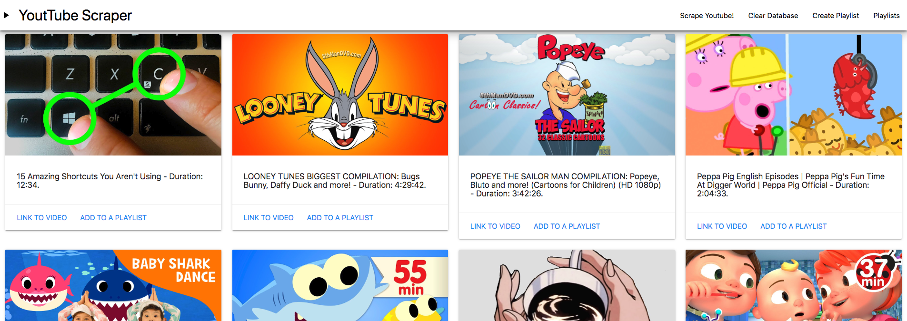

# Yotube MongoDB scraper

## What is the App?

Yotube scraper is a youtube homepage web scraper that uses axios, cheerio, and mongoose to scrape, sort and store video data. The webpage is deployed via heroku and utilizes  the mLab MongoDB addon to store data. Check out the page here! https://murmuring-fortress-54953.herokuapp.com/ Server framework uses express and express-handlebars to load large amounts of data. The webpage also allows for the creation and deletion of public playlists which are stored in the database. All user interaction is handled from the top navbar or from links below each video to keep things simple!

## How it Works

All rotuing and server code is handled in the server.js file. Data is scraped when the "scrape youtube" link is clicked and loaded onto the main page (you may have to refresh if data gets stored after you are redirected back to the main page). playlist creation/deletion, playlist song management, scraping and video list clearing are handled with click events which send AJAX requests to the server which then use mongoose to handle data stored in the database. 

### Purpose

The point of this exercise was to introduce basic data management using MongoDB and the potential it has to handle and use large amounts of similar data using a NoSQL database. Check out this and other projects on my Github! https://tmullen1991.github.io/

